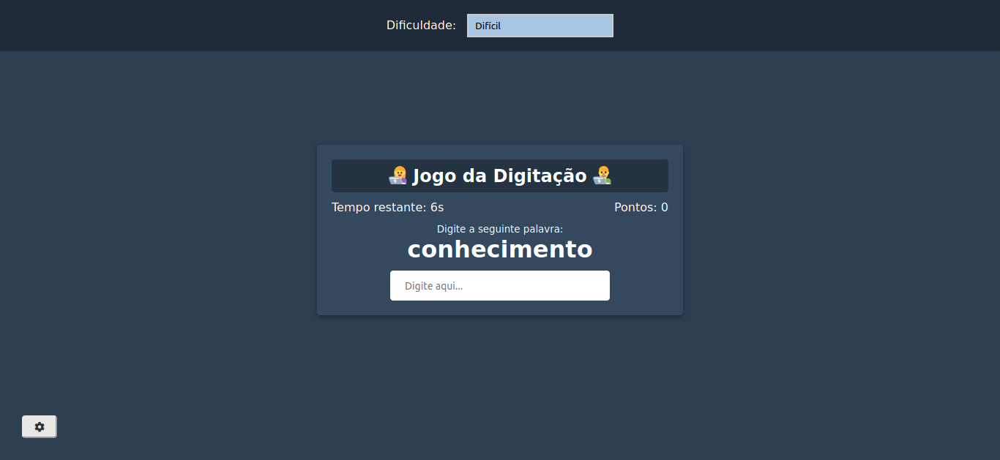

# typing-game

## Project

***EN:*** A simple yet fun game with 3 levels of difficulty. The objective of the game is to beat the clock by typing random words.

***PT-BR:*** Um simples, porém divertido jogo com 3 níveis de dificuldade. O objetivo do jogo é vercer o relógio digitando palavras aleatórias.

### Specifications
- Create game UI including a difficuly setting
- Generate random word and place in DOM
- Score increase after word is typed
- Implement timer
- Add certain amount of time after word is typed based on difficulty
- Store difficulty setting in local storage
***

## Technologies

This project was developed with the following technologies:

- HTML
- CSS
- JavaScript
***
 
## Preview

***

## License

This project is under the MIT license.
